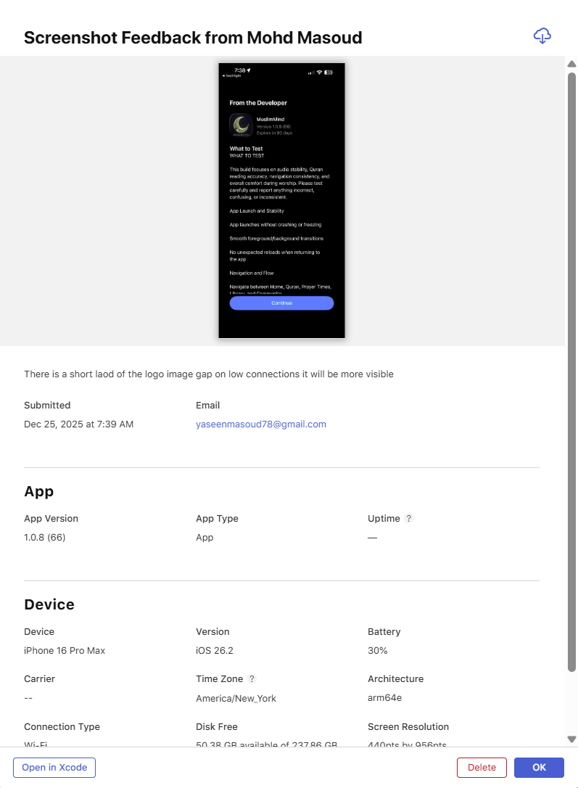

I phone user report , Zuhuz azan time 12:10, see screenshot azan setting to full azan, failed and did not play any azan. Look screenshot 2 bottom the reminder, 2 issues here , i did not ask for reminder but it showed reminder message” Adah: quality recitation” user expects azan reminder not asking for quality of the azan, rewrite user friendly muslim culture respected reminder . Issue to app moved from muslim life AI name and icon, alter mag still contains old logo